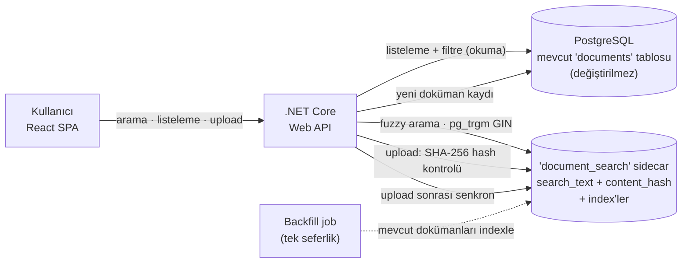

# Doküman Bulunabilirliği & Mükerrer Yükleme Çözümü

> Dahili doküman yönetim sistemi için, mevcut kısıtlar altında bulunabilirliği artıran ve mükerrer yüklemeyi azaltan bilinçli bir çözüm.

**Stack:** React (Vite) · .NET Core Web API · PostgreSQL
**Kısıtlar:** Mevcut DB şeması değiştirilemez · 3 ay ek altyapı yatırımı yok · ~8.000 günlük aktif kullanıcı · ortalama 400ms response bütçesi korunmalı

---

## 1) Problemi Yorumlama

### Problemi kendi cümlelerimle
Talep "arama kötü, düzeltin" gibi geliyor. Ama üç geri bildirime birlikte bakınca ortaya tek bir teknik problem değil, **üç ayrı problem** çıkıyor:

| Geri bildirim | Yüzeydeki okuma | Gerçek problem |
|---|---|---|
| "Dokümanı bulamıyorum" | Arama zayıf | Arama muhtemelen sadece tam/`LIKE` eşleşme yapıyor; yazım hatası, kısmi kelime, Türkçe karakter varyasyonlarında çuvallıyor. Metadata (tip/tarih/sahip) ile filtreleme yok. |
| "Aynı dokümanı tekrar yüklüyorum" | Arama zayıf | Bu **aramanın değil, upload akışının** problemi. Yüklerken "bu zaten var" kontrolü yok. |
| "Sonuçlar çok karışık" | Arama zayıf | Sıralama (relevance ranking) ve filtre yok; alakasız sonuçlar üstte geliyor. |

### Gerçek kök neden
Kök neden tek bir "kötü arama motoru" değil; **bulunabilirlik (findability) + upload anında dedup eksikliği + zayıf metadata** üçlüsü. En kritik gözlem: *mükerrer yükleme, aramanın bir semptomu değil bağımsız bir eksiklik.* Aramayı mükemmelleştirsek bile, yüklerken uyarı olmadığı sürece insanlar "bulamadım, baştan yüklerim" davranışını sürdürür.

### Talep yanlış bir varsayıma mı dayanıyor?
Evet. Örtük varsayım: **"daha iyi arama = çözüm."** Bu kısmen doğru ama eksik. Mükerrer yükleme problemi arama tarafından değil, upload tarafından çözülür. Bunu ayırmak, çözümün yarısını doğru yere koymak demek.

### Eksik olduğunu düşündüğüm bilgiler (netleşmesi gereken sorular)
- Mevcut arama tam olarak ne yapıyor? (`LIKE '%x%'` mi, halihazırda full-text index mi var?)
- `documents` tablosunun gerçek şeması ve indexleri neler?
- Toplam doküman sayısı ve aylık büyüme hızı? (fuzzy aramanın maliyeti buna bağlı)
- Arama logu var mı — insanlar **neyi** arayıp bulamıyor?
- "Duplicate" derken byte-identical dosya mı, yoksa "aynı sözleşmenin yeniden kaydedilmiş PDF'i" mi kastediliyor?
- **"DB değiştirilemez" tam olarak neyi kapsıyor** — mevcut tablo şeması mı donuk, yoksa yeni index/yardımcı tablo da mı yasak?

### Varsayımlarım (kısıtları bu şekilde yorumladım)
- `documents` tablosu kabaca: `id, title, file_name, doc_type, owner_id, created_at, file_size, storage_path`.
- **"DB değiştirilemez" = mevcut tabloların şeması ve verisi değiştirilemez.** Ancak aynı veritabanı içinde **yeni bir yardımcı (sidecar) tablo ve onun indexleri** eklenebilir. Bunu "ek altyapı" saymıyorum — yeni bir sistem/servis kurmuyorum, mevcut Postgres instance'ının içinde kalıyorum. *(Bu yorum bilinçli bir karardır; kısıt daha katı yorumlanırsa çözüm in-app arama katmanına çekilir — bkz. Bölüm 2.)*

---

## 2) Karar ve Tasarım Yaklaşımı

### Seçtiğim yaklaşım ve nedeni
**Postgres-native fuzzy full-text arama + hash tabanlı dedup — tek bir sidecar tablo üzerinden.**

- **Arama:** `pg_trgm` (trigram) extension'ı ile bulanık eşleşme + GIN index. Bu, yazım hatası ve kısmi kelime toleransı sağlar ("bulamıyorum" ve "karışık sonuç" şikayetlerini birlikte hedefler). Yeni bir arama motoru (Elasticsearch vb.) **kurmuyorum** — böylece "ek altyapı yok" kısıtına sadık kalıyorum.
- **Dedup:** Upload anında dosyanın **SHA-256 hash**'i hesaplanır ve sidecar tabloda aranır. Aynı hash varsa kullanıcıya *"Bu doküman zaten sistemde mevcut — işte burada"* denir. Asıl şikayet olan **tam kopya** tekrar yüklemelerini kaynağında keser.
- **Neden sidecar tablo?** Mevcut `documents` tablosuna hiç dokunmadan (ne kolon, ne trigger, ne index ekleyerek) çözüm kuruyorum. `document_search(document_id, search_text, content_hash)` tablosu + GIN trigram index (search_text) + btree index (content_hash). Mevcut dokümanlar tek seferlik bir **backfill** job'ı ile indexlenir; yeni yüklemeler API tarafından iki tabloya birden yazılır.

Bu neden 400ms bütçesini korur: aramalar transactional `documents` tablosunu değil, index'li sidecar'ı vurur; hash kontrolü index'li tekil kolonda sabit-maliyetlidir.

### Bilerek kabul ettiğim risk
- **Sidecar drift:** Sidecar, uygulama katmanında senkronize edilir (DB trigger ile değil). App'i bypass eden bir yükleme yolu (toplu import, direkt DB insert) olursa sidecar güncellenmez. Bu ölçekte kabul edilebilir; izleme + periyodik tutarlılık kontrolü ile yönetilir.
- **Hash yalnız byte-identical yakalar:** "Aynı sözleşmenin yeniden export edilmiş PDF'i" farklı hash üretir → yakalanmaz. Bunu bilerek kapsam dışı bırakıyorum (bkz. aşağı).

### Bilerek YAPMADIKLARIM (ve nedeni)
- **Elasticsearch / OpenSearch / vektör-semantik arama yok** → "ek altyapı yok" kısıtını ihlal eder, bu ölçek için overengineering.
- **Embedding / LLM tabanlı semantik dedup yok** → maliyet ve gizlilik yükü, MVP için gereksiz.
- **OCR / doküman içeriği çıkarma yok** → ayrı ve pahalı bir problem; şikayetler içerik-arama değil bulunabilirlik odaklı.
- **Mevcut şema migration'ı / trigger yok** → kısıtın ruhu bu; sidecar ile kaçındım.
- **Tam rewrite yok** → mevcut sistemin üzerine ince bir katman ekliyorum.

### MVP kapsamını nasıl belirledim
Sadece üç geri bildirimi doğrudan çözen minimum set:
1. **Listeleme** + tip/tarih/sahip **filtreleri** ("karışık sonuç" → yapılandırılmış daraltma)
2. **Fuzzy arama** (typo toleranslı) — "bulamıyorum"un ana çözümü
3. **Anlamlı feedback** — sonuç sayısı, boş durum ("sonuç yok — şunu mu demek istedin?"), yükleme sonucu mesajları
4. **Hash tabanlı dedup uyarısı** — "tekrar yüklüyorum"un ana çözümü

Bunun ötesindeki her şey (ranking ML, near-duplicate içerik tespiti, öneri) v2'ye bırakıldı.

### Mimari Diyagram



---

## 3) Çalışan Prototip

### Özellikler
- **Doküman listeleme** — sayfalama + tip/tarih/sahip filtreleri
- **Fuzzy arama** — `pg_trgm` similarity ile yazım hatası toleranslı, relevance'a göre sıralı
- **Anlamlı geri bildirim** — sonuç sayısı, boş durum önerisi, upload sonucu mesajları
- **Dedup mekanizması** — upload'ta SHA-256 hash kontrolü, çakışmada mevcut dokümanı gösterip uyarı verir

### Yapı
```
/client   → React (Vite): DocumentList, SearchBar, Filters, UploadDialog
/server   → .NET Core Web API: DocumentsController, SearchService, DedupService
/db       → init.sql (documents seed) + search_index.sql (sidecar + index'ler + backfill)
```

### Çalıştırma
```bash
# DB
docker compose up -d db
psql ... -f db/init.sql -f db/search_index.sql

# API
cd server && dotnet run

# Client
cd client && npm install && npm run dev
```
*(Komutlar kod adımında kesinleştirilecek.)*

---

## 4) Teknik Değerlendirme

**1. Bu çözüm 6 ay sonra neden problem çıkarabilir?**
İki nedenle. (a) **Sidecar drift**: app'i bypass eden yükleme yolları (toplu import, admin, direkt DB) zamanla birikirse arama/dedup index'i gerçekle uyumsuz kalır. (b) Kök-neden olan **metadata kalitesi** çözülmediği için, doküman hacmi büyüdükçe trigram tek başına "karışık sonuç" hissini tam bitiremez; relevance ranking'e yatırım gerekir.

**2. 10.000 kullanıcıya ölçeklendiğinde ilk kırılacak nokta?**
**Paylaşılan primary Postgres.** Okuma-ağır fuzzy aramalar, transactional yükle aynı instance'ta yarışır; connection pool ve 400ms bütçesi ilk burada kırılır. Doğru çözüm arama sorgularını bir **read-replica**'ya yönlendirmek — ki bu "ek altyapı" olduğu için şu an bilinçli kabul ettiğimiz tavandır.

**3. En zayıf gördüğüm teknik kararım?**
Sidecar'ı **DB trigger yerine uygulama katmanında** senkronize etmek. Trigger daha sağlam tutarlılık verirdi ama mevcut tabloya trigger eklemek kısıtın gri bölgesi + bakım yükü. Şeffaflık ve basitlik için app-sync seçtim; drift riski en zayıf noktam.

**4. Bu çözümde beni en rahatsız eden teknik nokta?**
Aslında bir **veri-kalitesi/UX problemini bir arama yamasıyla** çözüyor olmam. Ayrıca hash yalnız byte-identical dedup yapıyor; kullanıcının "aynı doküman" dediği şey çoğu zaman byte-identical değil — yani "tekrar yükleme" derdinin bir kısmı hâlâ açıkta.

---

## 5) İletişim

### İş Birimine Açıklama (teknik olmayan dil)
Şu an ekip arkadaşlarımız doküman ararken çok vakit kaybediyor; bulamayınca da aynı dosyayı tekrar yüklüyor, bu da sistemi daha da karıştırıyor. Bu çalışmayla iki şey değişiyor: **arama artık yazım hatalarını ve eksik kelimeleri tolere ediyor**, yani "tam adını hatırlamıyorum" derdi büyük ölçüde bitiyor; bir de **yüklerken sistem "bu doküman zaten var, işte burada" diye uyarıyor**, böylece mükerrer yükleme ve kalabalık azalıyor. Bunu yeni bir sistem kurmadan, ek masraf çıkarmadan ve mevcut hızı yavaşlatmadan yapıyoruz.

### CTO'ya Teknik Özet (dürüst risk & borç)
Çözüm: `pg_trgm` ile Postgres-native fuzzy full-text arama + SHA-256 hash dedup, **mevcut tablolara hiç dokunmadan** tek bir sidecar tablo (`document_search`) üzerinden. Yeni altyapı yok, 400ms bütçesi index'lerle korunuyor.
**Teknik borçlar, açıkça:** (1) Sidecar app-katmanında senkronize; drift riski var — orta vadede DB trigger ya da CDC'ye geçiş gerekir. (2) Arama primary DB'de çalışıyor; ~10k kullanıcıda read-replica şart olacak. (3) Hash yalnız exact-duplicate yakalıyor; semantik/near-duplicate kapsam dışı. (4) Asıl kök neden olan metadata kalitesi çözülmedi — bu bir yama, kalıcı çözüm değil.
**İzleme gereksinimi:** arama sorgu latency'si + sidecar tutarlılık kontrolü günlük ölçülmeli.
